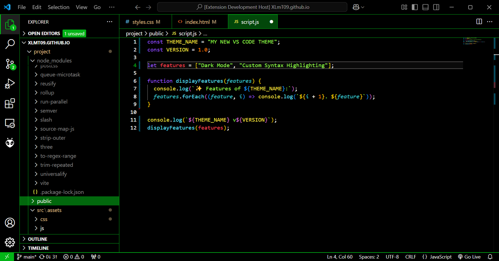

# XLmT09 Theme

A sleek black and green VS Code theme with vibrant neon syntax colours for the editor.

## Roadmap
I will periodically update this theme where needed.

## Credits
To create the theme initially, I used [themes.vscode](https://themes.vscode.one/), and then made adjustments to the JSON file to suit my preferences.
